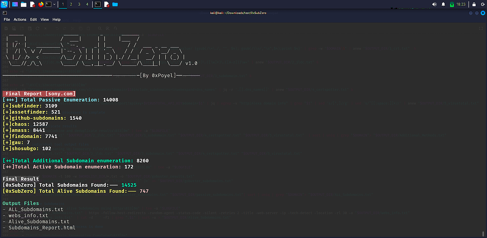

<h1 align="center">「🐦‍🔥」 0xSubZero - Automated Subdomain Enumeration Tool</h1>

<p align="center"></p>

## Description
0xSubZero automates the entire subdomain enumeration process using various tools and APIs, making reconnaissance more efficient.
- Collects subdomains from various sources (Passive, Active, APIs)
- Filters & de-duplicates results
- Performs active DNS brute-forcing
- Identifies live subdomains using httpx
- Generates detailed HTML reports
- Logs all actions for easy debugging

## Features
- Passive Subdomain Enumeration (via OSINT tools & APIs)
- Active Subdomain Enumeration (via brute-forcing)
- Multiple Enumeration Techniques (Certificates, GitHub, VirusTotal, etc.)
- Live Subdomain Checking using httpx
- Automatic HTML Report Generation
- Tool Installation & API Key Validation
- Error Handling & Logging

## Tools Required

0xSubZero integrates multiple tools for passive and active subdomain enumeration. Below is a list of required tools and their purpose:

1. `Subfinder` Passive subdomain enumeration from public sources
2. `Assetfinder` Finds subdomains using OSINT techniques
3. `Amass` Subdomain discovery via multiple reconnaissance techniques
4. `Findomain` Fast subdomain discovery using certificate transparency and APIs
5. `Gau` Fetches URLs from sources like Wayback Machine
6. `Httpx` Identifies live subdomains, status codes, and web technologies
7. `Gobuster` Performs DNS brute-force enumeration
8. `Unfurl` Extracts subdomains from long URLs
9. `GitHub-Subdomains` Extracts subdomains from GitHub repositories
10. `Chaos`	Retrieves subdomains using Project Discovery's API
11. `Shosubgo`	Shosubgo	Finds subdomains using Shodan API

## Installation Instructions

### Step 1: Clone the Repository

```bash
git clone https://github.com/0xPoyel/0xSubZero.git
cd 0xSubZero
```
### Step 2: Install Required Tools
```bash
chmod +x install.sh
./install.sh
```
### Step 3: Configure API Keys
 `Config/api_keys.txt`  add your API keys:
```bash
GITHUB_TOKEN=your_github_token
CHAOS_API_KEY=your_chaos_api_key
SHODAN_API_KEY=your_shodan_api_key
VIRUSTOTAL_API_KEY=your_virustotal_api_key
```

## Usage Instructions
### Step 1: Basic Subdomain Enumeration
```bash
chmod +x 0xSubZero.sh
./0xSubZero.sh example.com
```
### Step 2: Check Installed Tools
```bash
./0xSubZero.sh -c
```
### Step 3: Install Missing Tools
```bash
./0xSubZero.sh -i
```
### Step 4: Validate API Keys
```bash
./0xSubZero.sh -a
```
### Step 6: View Help Menu
```bash
┌──(kali㉿kali)-[~/0xSubZero]
└─$ ./0xSubZero.sh -h

  _____             _____       _      ______               
 |  _  |           /  ___|     | |    |___  /               
 | |/' |_  ________\ `--. _   _| |__     / /  ___ _ __ ___  
 |  /| \ \/ /______|`--. \ | | | '_ \   / /  / _ \ '__/ _ \ 
 \ |_/ />  <       /\__/ / |_| | |_) |./ /__|  __/ | | (_) |
  \___//_/\_\      \____/ \__,_|_.__/ \_____/\___|_|  \___/ v1.0

────────────────────────────────────────────[By 0xPoyel]─────────

Subdomain Enumeration - Help Menu
Usage: ./0xSubZero.sh <domain>

Options:
  <domain>          Run the subdomain enumeration for the specified dsomain.
  -c, --check       Check if all required tools are installed.
  -i, --install     Install all required tools.
  -a, --apikey      Validate that all required API keys are present.
  -h, --help        Display this help menu.

Examples:
  ./0xSubZero.sh example.com
  ./0xSubZero.sh -c
  ./0xSubZero.sh -i
  ./0xSubZero.sh -a
```
## YouTube Tutorial
Watch a full video tutorial here:

## Output Files

After execution, the results are stored in an automatically created results directory (e.g., subdomain_example.com_YYYY-MM-DD_HH:MM:SS

1. `ALL_Subdomains.txt` Complete list of discovered subdomains
2. `Alive_Subdomains.txt` List of subdomains that are alive
3. `webs_info.txt` Detailed information about live subdomains (IP, tech, etc.)
4. `Subdomains_Report.html` Interactive HTML report

## Example
```bash
../0xSubZero.sh example.com
```
### Example Output Directory:

```bash
subdomain_example.com_2025-02-28_14:30:00
│── ALL_Subdomains.txt
│── Alive_Subdomains.txt
│── webs_info.txt
│── Subdomains_Report.html
```
### Sample Subdomains Found (ALL_Subdomains.txt):
```bash
admin.example.com
mail.example.com
dev.example.com
beta.example.com
```
### Sample Alive Subdomains (Alive_Subdomains.txt):
```bash
admin.example.com
mail.example.com
```
### Sample Web Info (webs_info.txt):
```bash
https://admin.example.com [200] [Admin Portal] [IP: 192.168.1.1] [nginx] [PHP, JavaScript]
https://mail.example.com [403] [Mail Server] [IP: 192.168.1.2] [Apache] [Python, React]
```
### Sample HTML Report (Subdomains_Report.html):

🔗 View Sample HTML Report

### Dependencies
- OS: Linux (Debian-based)
- Tools: `curl` `jq` `git` `go` `python3-pip`
- Go Packages: `gau` `httpx` `subfinder` `chaos-client` `github-subdomains`
- Python Modules: `shodan` `censys`

To install dependencies manually:
```bash
sudo apt update && sudo apt install -y curl jq git golang python3-pip
pip3 install shodan censys
```
##  Reminder
⚠️ Responsible Disclosure Policy
- Only test on domains you own or have explicit permission to test.
- Do not use for illegal activities.
- Respect rate limits & API usage policies.

<h1> Happy Hunting! 🕵️‍♂️</h1>

